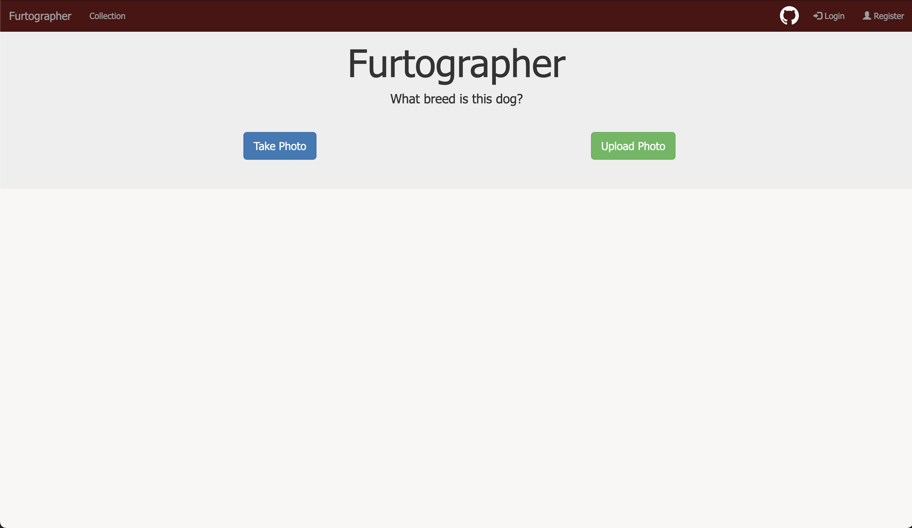
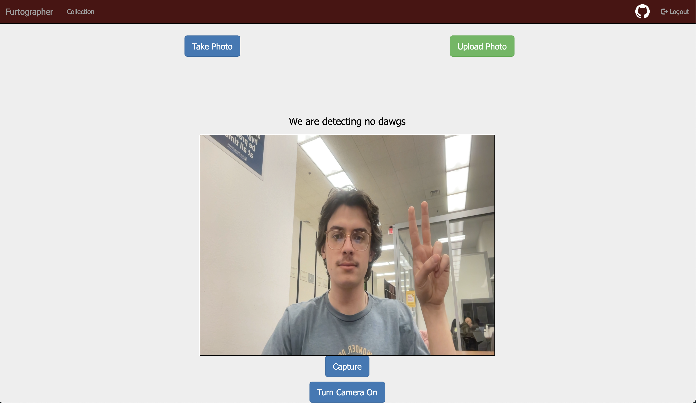
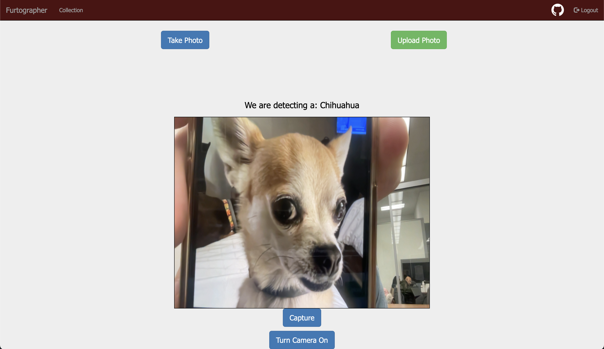
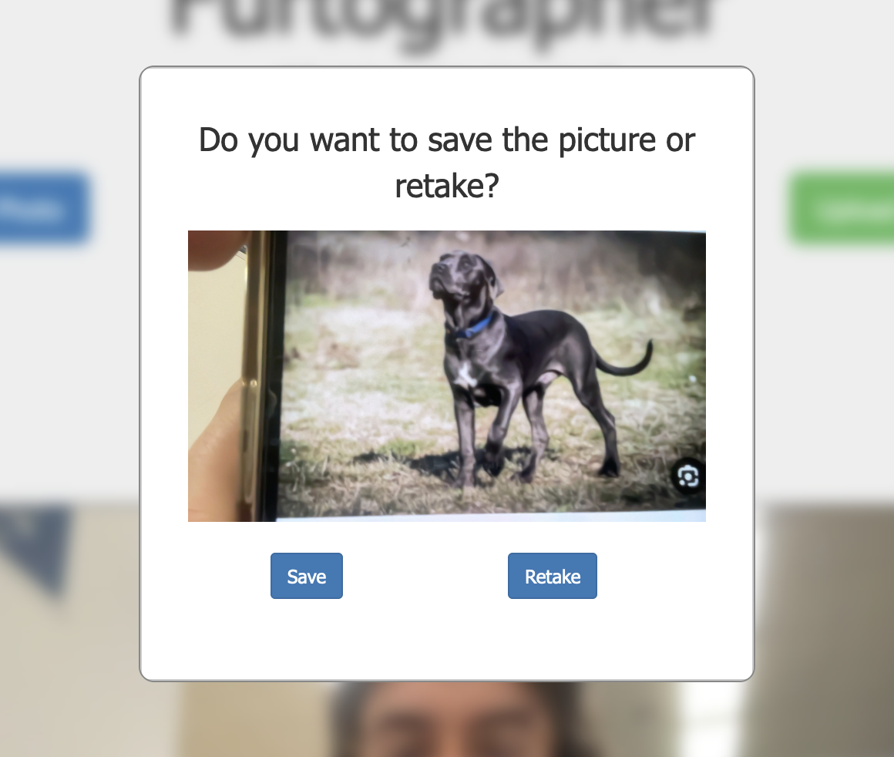
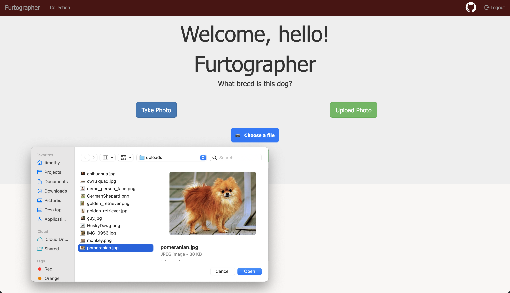
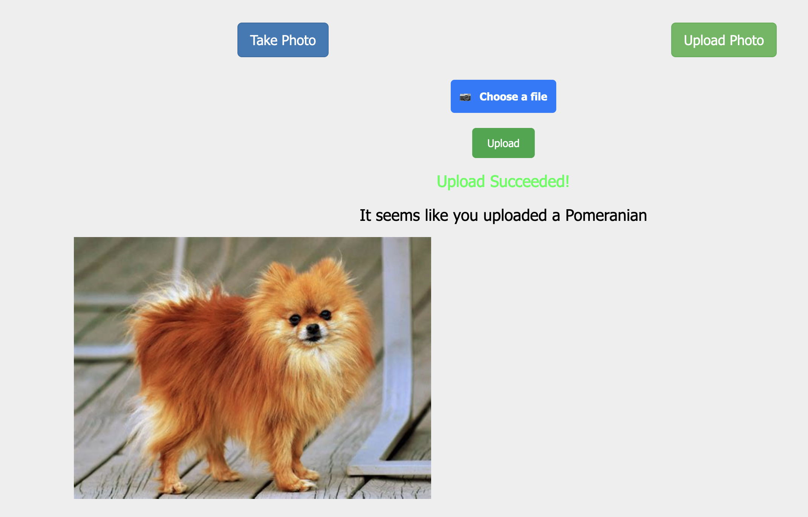
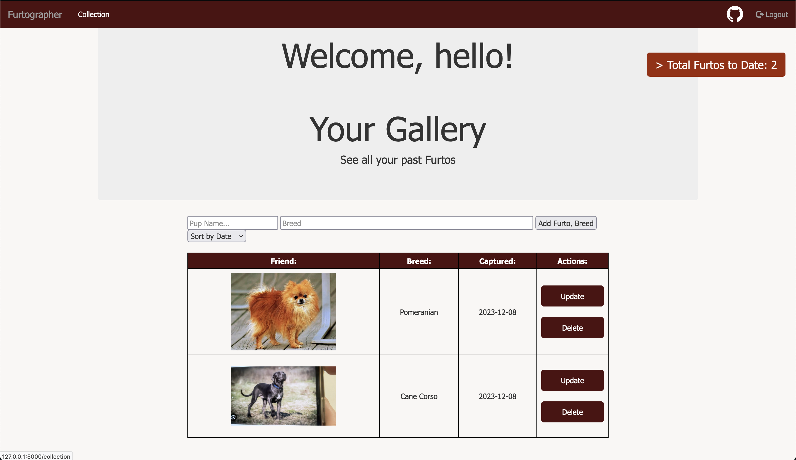

# How To Use

## First Screen Without Login

  

On this screen, you can either begin classifying without an account, or you can create an account by clicking register and following the steps to create an account. After this, you will be directed back to the home screen with a message with your username.

## Take Photo
### Live Detection

  

  

After clicking capture, you will be greeted with this menu

  

Press save to classify and save it to your collection.
Press retake to retake the image.

## Upload Photo

  

## After Classifying, This Menu Will Be Shown

  

## Collection
Check out your collection by pressing the collection tab

  

## Logout
To logout press the logout button at the top right.
